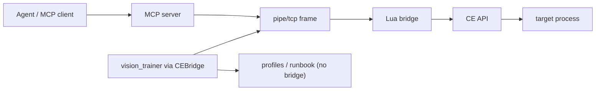
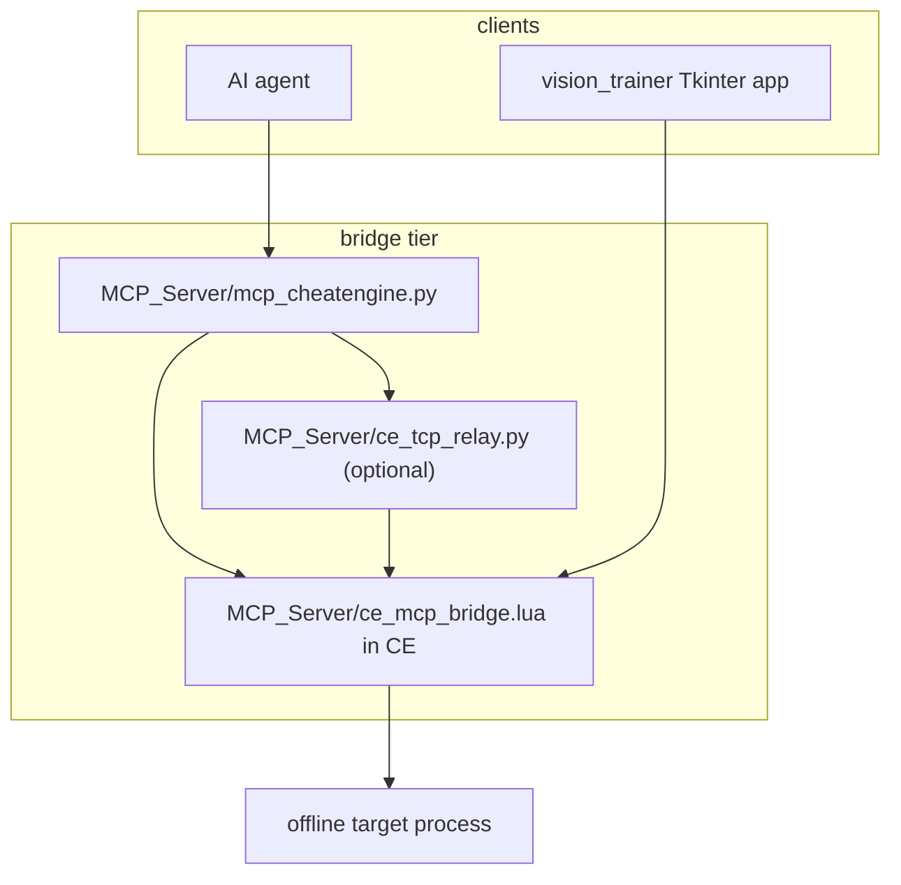
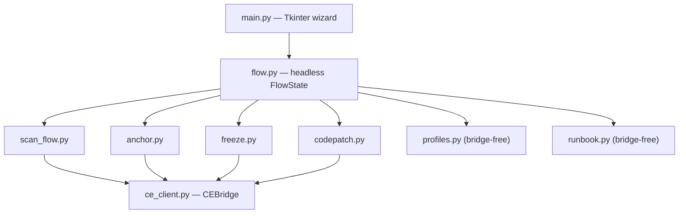

# Architecture Diagrams — Trainer Application

## Dependency direction (rule AD-11)

```mermaid
graph LR
  A["Agent / MCP client"] --> B["MCP server"]
  B --> P["pipe/tcp frame"]
  V["vision_trainer via CEBridge"] --> P
  P --> L["Lua bridge"]
  L --> CE["CE API"]
  CE --> T["target process"]
  V --> S["profiles / runbook (no bridge)"]
```

## System containers

```mermaid
graph TD
  subgraph clients [clients]
    A["AI agent"]
    V["vision_trainer Tkinter app"]
  end
  subgraph bridge [bridge tier]
    M["MCP_Server/mcp_cheatengine.py"]
    R["MCP_Server/ce_tcp_relay.py (optional)"]
    L["MCP_Server/ce_mcp_bridge.lua in CE"]
  end
  A --> M
  M --> L
  M --> R
  R --> L
  V --> L
  L --> T["offline target process"]
```

## vision_trainer layering

```mermaid
graph TD
  UI["main.py — Tkinter wizard"] --> FS["flow.py — headless FlowState"]
  FS --> SF["scan_flow.py"]
  FS --> AN["anchor.py"]
  FS --> FR["freeze.py"]
  FS --> CP["codepatch.py"]
  SF --> CC["ce_client.py — CEBridge"]
  AN --> CC
  FR --> CC
  CP --> CC
  FS --> PR["profiles.py (bridge-free)"]
  FS --> RB["runbook.py (bridge-free)"]
```
